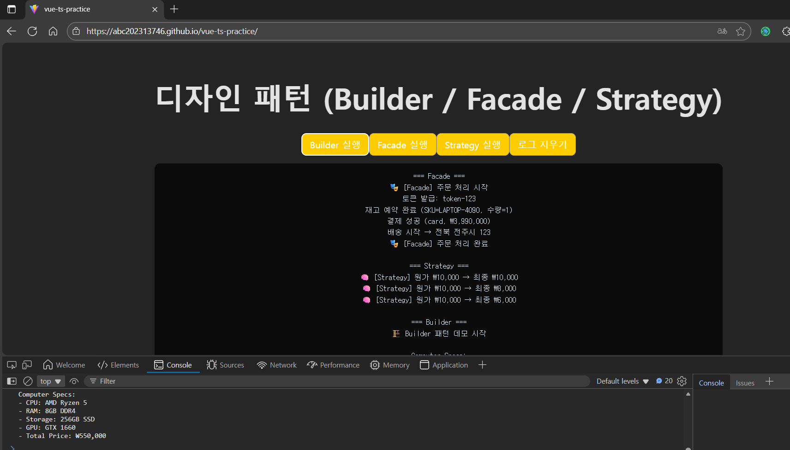

# Vue 3 + TypeScript + Vite 디자인 패턴

<br>



## 저장소 링크

https://github.com/abc202313746/vue-ts-practice.git


## 배포 링크

https://abc202313746.github.io/vue-ts-practice/

***


## 디자인 패턴 요약

### 1. 생성 패턴 - **Builder**

- 복잡한 `Computer` 객체를 단계별로 구성해 생성 과정을 분리합니다.
- `ComputerDirector`로 미리 정의된 사양(게이밍 PC, 사무용 PC 등)을 만들거나  
  `ConcreteComputerBuilder`로 직접 부품을 조합할 수 있습니다.
- 파일: `src/patterns/Builder.ts`

---

### 2. 구조 패턴 - **Facade**

- 여러 서브시스템(인증, 재고, 결제, 배송)을 하나의 인터페이스로 단순화합니다.
- 클라이언트는 `OrderFacade`의 `placeOrder()` 한 번만 호출하면 전체 주문 절차가 처리됩니다.
- 파일: `src/patterns/facade.ts`

---

### 3. 행위 패턴 - **Strategy**

- 다양한 할인 정책을 전략 클래스로 분리해 동적으로 교체할 수 있습니다.
- `Checkout`은 `PricingStrategy` 인터페이스만 의존하며  
  `setStrategy()`로 할인 방식을 변경할 수 있습니다.
- 파일: `src/patterns/strategy.ts`

---

## 실행 방법

```bash
npm install
npm run dev
